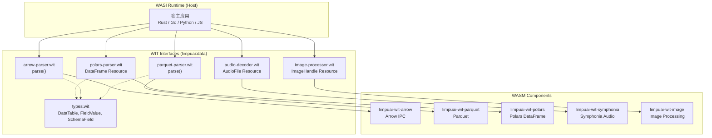
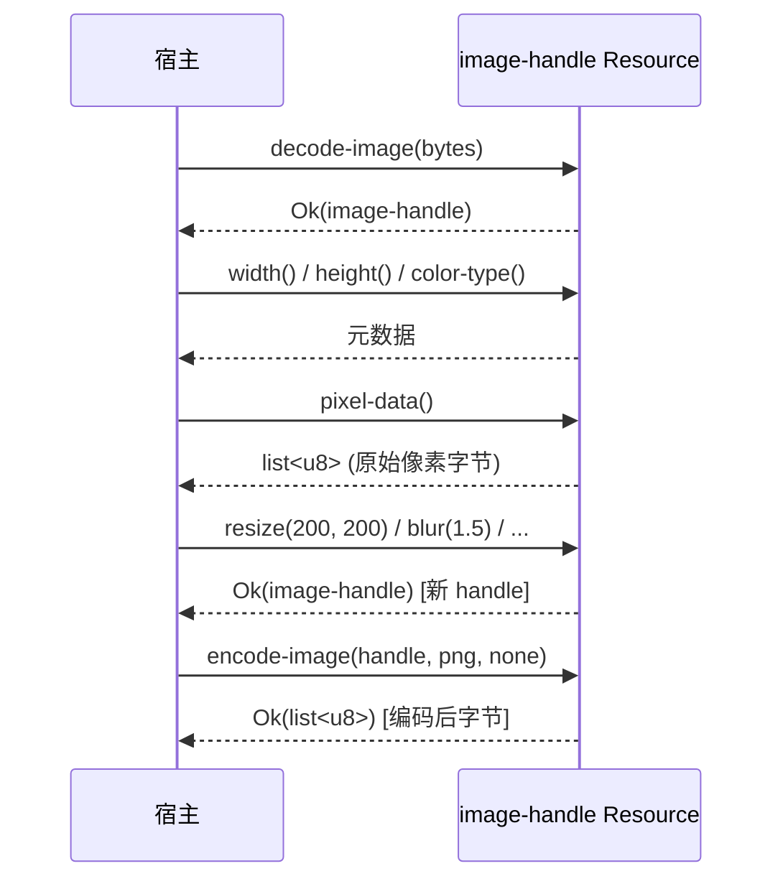
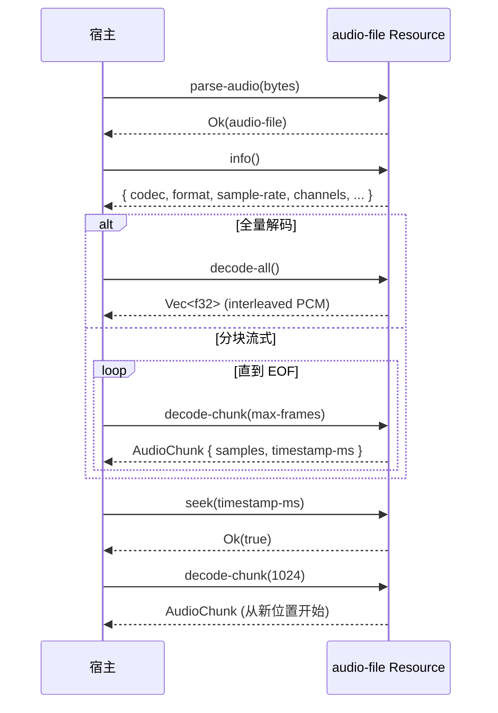

# limpuai-wit

将优秀的第三方库编译为 [WASI Component](https://component-model.bytecodealliance.org/)，提供标准 WIT 接口供任何 WASI 运行时动态链接使用。

## 为什么构建这个项目

一些优秀的第三方库没有官方的 WIT + WASM 发布，因此本项目承担这一职责：

- 定义 WIT 接口（当前为 `limpuai:data`，后续按需扩展更多 package）
- 将三方库编译为 WASI Component（wasm32-wasip2）

不对三方库源码做任何改动，仅做接口定义和编译导出。

## 架构



## 组件一览

| 组件 | 功能 | 底层库 | WASM 大小 |
|------|------|--------|----------|
| **limpuai-wit-arrow** | Arrow IPC 解析 | `arrow` 54.x | ~1.1 MB |
| **limpuai-wit-parquet** | Parquet 解析 | `parquet` 54.x | ~6.1 MB |
| **limpuai-wit-polars** | DataFrame 操作 (CSV/JSON/Select/Filter/Sort/GroupBy/Join) | `polars` 0.53 | ~26 MB |
| **limpuai-wit-symphonia** | 音频解码 (WAV/FLAC/MP3/OGG/AIFF) | `symphonia` 0.5 | ~1.5 MB |
| **limpuai-wit-image** | 图像解码/操作/编码 (PNG/JPEG/GIF/WebP/TIFF/BMP/...) | `image` 0.25 | ~3.2 MB |

## 项目结构

```
wit/                          # 统一 WIT 定义 (limpuai:data)
  types.wit                   # 共享类型: DataTable, FieldValue, SchemaField
  arrow-parser.wit            # Arrow IPC 解析接口 + world
  parquet-parser.wit          # Parquet 解析接口 + world
  polars-parser.wit           # Polars DataFrame resource 接口 + world
  audio-decoder.wit           # 音频解码 resource 接口 + world
  image-processor.wit         # 图像处理 resource 接口 + world
crates/
  limpuai-wit-arrow/          # Arrow IPC 解析组件
  limpuai-wit-parquet/        # Parquet 解析组件
  limpuai-wit-polars/         # Polars DataFrame 组件
  limpuai-wit-symphonia/      # 音频解码组件
  limpuai-wit-image/          # 图像解码/操作/编码组件
```

## WIT 接口

### 共享类型 (`types`)

```wit
record schema-field { name: string, data-type: string }
record data-table { columns: list<schema-field>, rows: list<list<field-value>> }
variant field-value { numeric(f64), text(string), timestamp(f64), boolean(bool), null }
```

### Arrow IPC / Parquet — 函数式接口

两个组件导出相同的函数签名，输入原始文件字节，输出结构化 `DataTable`：

```wit
parse: func(data: list<u8>) -> result<data-table, string>
```

### Polars — Resource 接口

通过 WIT resource 持有 DataFrame 状态，支持链式操作：

```wit
resource dataframe {
    columns: func() -> list<schema-field>;
    height: func() -> u64;
    width: func() -> u64;
    select: func(columns: list<string>) -> result<dataframe, string>;
    filter: func(column: string, op: filter-op, value: field-value) -> result<dataframe, string>;
    sort: func(by: list<sort-option>) -> result<dataframe, string>;
    head: func(n: u64) -> result<dataframe, string>;
    tail: func(n: u64) -> result<dataframe, string>;
    unique: func(subset: option<list<string>>) -> result<dataframe, string>;
    group-by: func(by: list<string>, aggregations: list<aggregation>) -> result<dataframe, string>;
    to-table: func() -> result<data-table, string>;
}
parse-csv: func(data: list<u8>) -> result<dataframe, string>;
parse-json: func(data: list<u8>) -> result<dataframe, string>;
join: func(left: dataframe, right: dataframe, left-on: list<string>, right-on: list<string>, how: join-type) -> result<dataframe, string>;
```

> 详细的 Polars 类型映射和局限性见 [`crates/limpuai-wit-polars/README.md`](crates/limpuai-wit-polars/README.md)。

### Symphonia Audio — Resource 接口

通过 WIT resource 持有解码器状态，支持流式解码和 seek：

```wit
resource audio-file {
    info: func() -> audio-info;
    decode-all: func() -> result<list<f32>, string>;
    decode-chunk: func(max-frames: u64) -> result<audio-chunk, string>;
    seek: func(timestamp-ms: u64) -> result<bool, string>;
    position: func() -> u64;
}
parse-audio: func(data: list<u8>) -> result<audio-file, string>;
```

支持的音频格式：WAV (PCM)、FLAC、MP3 (MPEG Audio Layer III)、OGG Vorbis、AIFF。

### Image Processor — Resource 接口

通过 WIT resource 持有图像状态，支持解码、基本操作和编码输出：

```wit
resource image-handle {
    width: func() -> u32;
    height: func() -> u32;
    color-type: func() -> color-type;
    pixel-data: func() -> list<u8>;
    resize: func(width: u32, height: u32) -> result<image-handle, string>;
    crop: func(x: u32, y: u32, width: u32, height: u32) -> result<image-handle, string>;
    blur: func(sigma: f32) -> result<image-handle, string>;
    brighten: func(value: f32) -> result<image-handle, string>;
    contrast: func(value: f32) -> result<image-handle, string>;
    grayscale: func() -> result<image-handle, string>;
    invert: func() -> result<image-handle, string>;
    fliph: func() -> result<image-handle, string>;
    flipv: func() -> result<image-handle, string>;
    rotate90: func() -> result<image-handle, string>;
    rotate180: func() -> result<image-handle, string>;
    rotate270: func() -> result<image-handle, string>;
}
decode-image: func(data: list<u8>) -> result<image-handle, string>;
encode-image: func(img: image-handle, format: output-format, quality: option<u8>) -> result<list<u8>, string>;
image-info: func(data: list<u8>) -> result<image-meta, string>;
```

支持的图像格式（解码）：PNG、JPEG、GIF、WebP、TIFF、BMP、ICO、PNM、QOI、TGA、HDR、Farbfeld、EXR。
支持的编码输出格式：PNG、JPEG、BMP、GIF、TIFF、ICO、WebP、PNM。

> **注意**: `encode-image` 按值接收 `image-handle`（WIT 语义下 handle 被 consume），调用后该 handle 在宿主端失效。`invert` 操作会原地修改图像像素。

#### 数据流



#### 数据流



## 类型映射

### Arrow / Parquet → WIT

| Arrow 类型 | WIT FieldValue |
|---|---|
| Int8/16/32/64, UInt8/16/32/64, Float32/64 | `numeric(f64)` |
| Boolean | `boolean(bool)` |
| Utf8, LargeUtf8 | `text(string)` |
| Date32, Date64, Timestamp(*, _) | `timestamp(f64)` (毫秒) |
| Null | `null` |

### Polars → WIT

| Polars DataType | WIT FieldValue |
|---|---|
| Int*/UInt*/Float* | `numeric(f64)` |
| Boolean | `boolean(bool)` |
| String | `text(string)` |
| Date, Datetime | `timestamp(f64)` (毫秒) |
| Null / 其他 | `null` |

### Symphonia → WIT

| Symphonia 类型 | WIT 类型 |
|---|---|
| `AudioBufferRef` | 内部处理，不暴露 |
| `SampleBuffer<f32>` | `list<f32>` (交错 PCM) |
| `SignalSpec` (rate, channels) | `audio-info.sample-rate`, `audio-info.channels` |
| `Time` (seconds + frac) | `timestamp-ms: u64` (毫秒) |

### Image → WIT

| image-rs ColorType | WIT color-type | 字节/像素 |
|---|---|---|
| L8 | `l8` | 1 |
| La8 | `la8` | 2 |
| Rgb8 | `rgb8` | 3 |
| Rgba8 | `rgba8` | 4 |
| L16 | `l16` | 2 |
| La16 | `la16` | 4 |
| Rgb16 | `rgb16` | 6 |
| Rgba16 | `rgba16` | 8 |
| Rgb32F | `rgb32f` | 12 |
| Rgba32F | `rgba32f` | 16 |

## 构建

需要 `wasm32-wasip2` target：

```bash
rustup target add wasm32-wasip2
cargo build --target wasm32-wasip2 --release
```

单独构建某个组件：

```bash
cargo build --target wasm32-wasip2 --release -p limpuai-wit-symphonia
```

产出：
- `target/wasm32-wasip2/release/limpuai_wit_arrow.wasm` (~1.1 MB)
- `target/wasm32-wasip2/release/limpuai_wit_parquet.wasm` (~6.1 MB)
- `target/wasm32-wasip2/release/limpuai_wit_polars.wasm` (~26 MB)
- `target/wasm32-wasip2/release/limpuai_wit_symphonia.wasm` (~1.5 MB)
- `target/wasm32-wasip2/release/limpuai_wit_image.wasm` (~3.2 MB)

## 测试

```bash
cargo test                    # 全部
cargo test -p limpuai-wit-symphonia  # 单个组件
```

## 依赖

| 库 | 版本 | 许可证 | 用途 |
|---|---|---|---|
| `arrow` | 54.x | Apache-2.0 | Arrow IPC 解析 |
| `parquet` | 54.x | Apache-2.0 | Parquet 解析 |
| `polars` | 0.53 | MIT | DataFrame 操作 |
| `symphonia` | 0.5 | MPL-2.0 | 音频解码 |
| `image` | 0.25 | MIT OR Apache-2.0 | 图像解码/操作/编码 |
| `wit-bindgen` | 0.57 | Apache-2.0 | WIT 绑定生成 |

第三方许可证详情见 [`THIRD-PARTY-LICENSES.md`](THIRD-PARTY-LICENSES.md)。

## License

Apache-2.0
